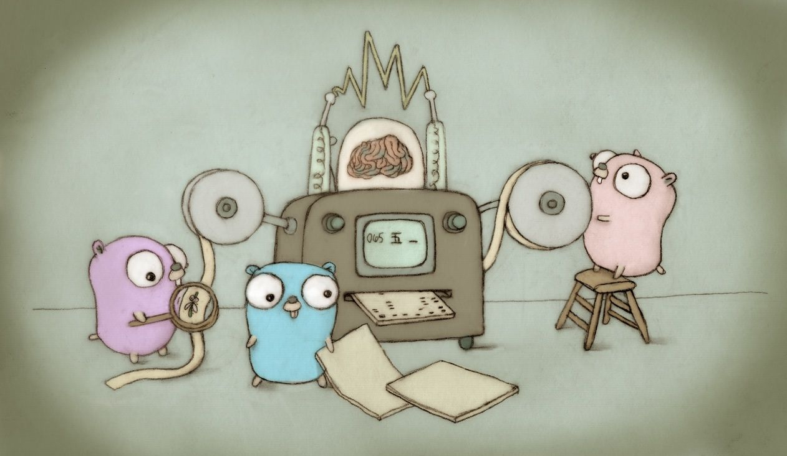

# Golang Template



This is a golang server template. It uses Gin, GORM and PostreSQL.

## Usage

1. Clone the repo

   ```sh

   git clone https://github.com/karokojnr/golang-template.git

   ```

2. Install go packages

   ```sh

   go mod download

   ```

3. To run the app:

   ```sh

   go run main.go

   ```


## Contributing

Pull requests are welcome. For major changes, please open an issue first to discuss what you would like to change.
